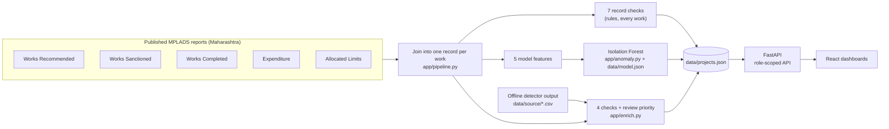
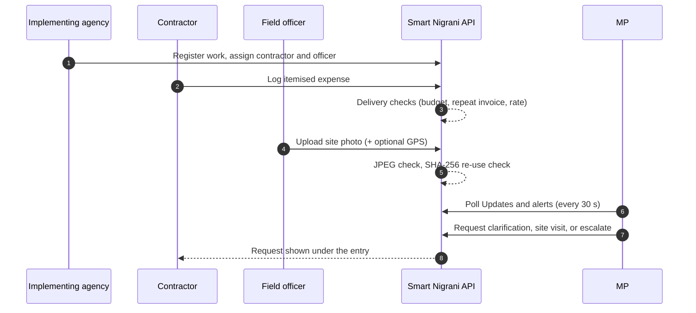
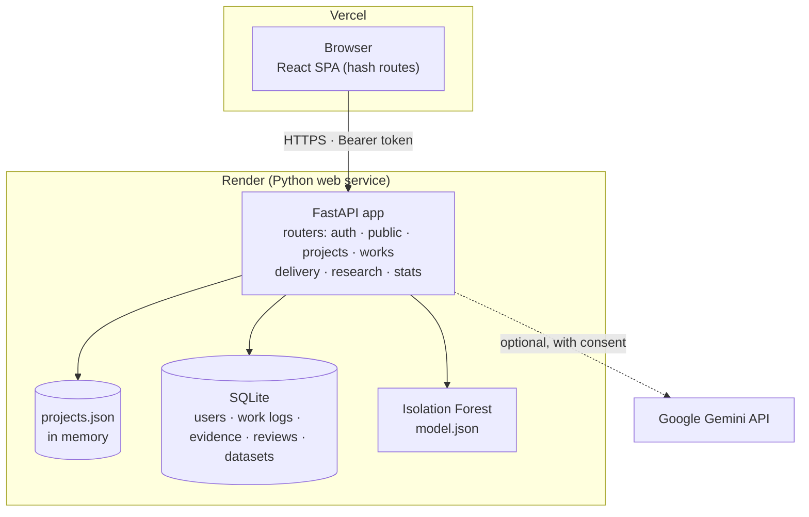
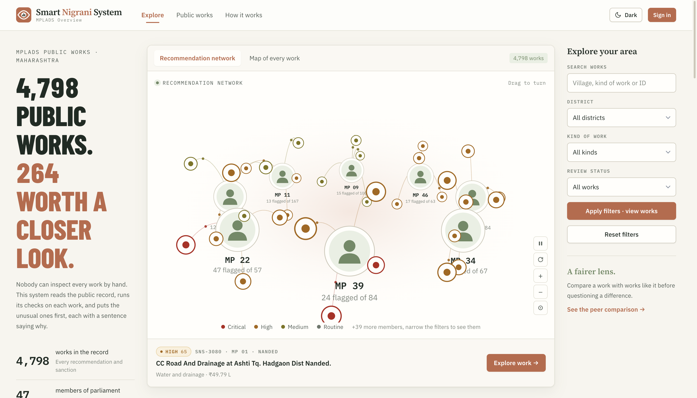
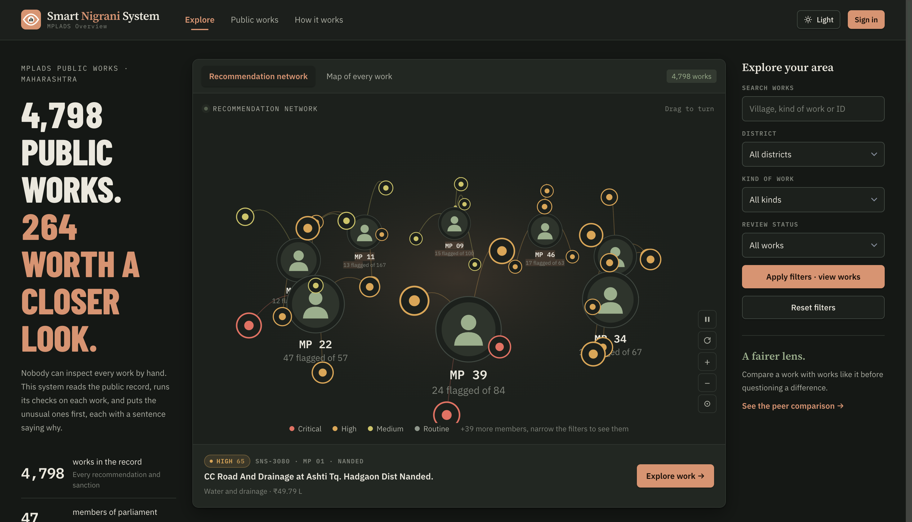
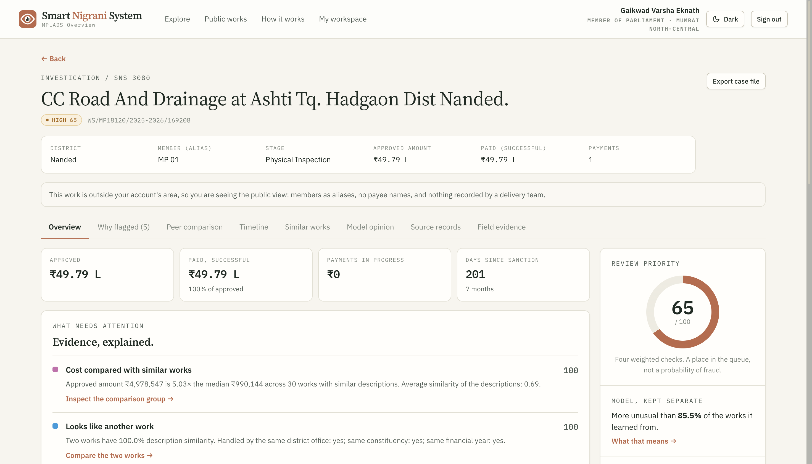
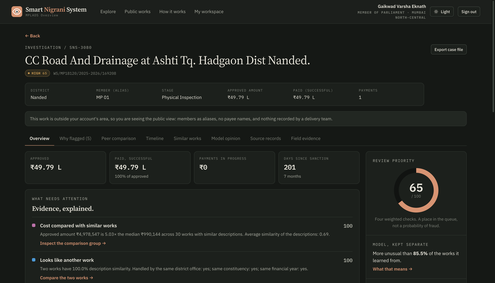
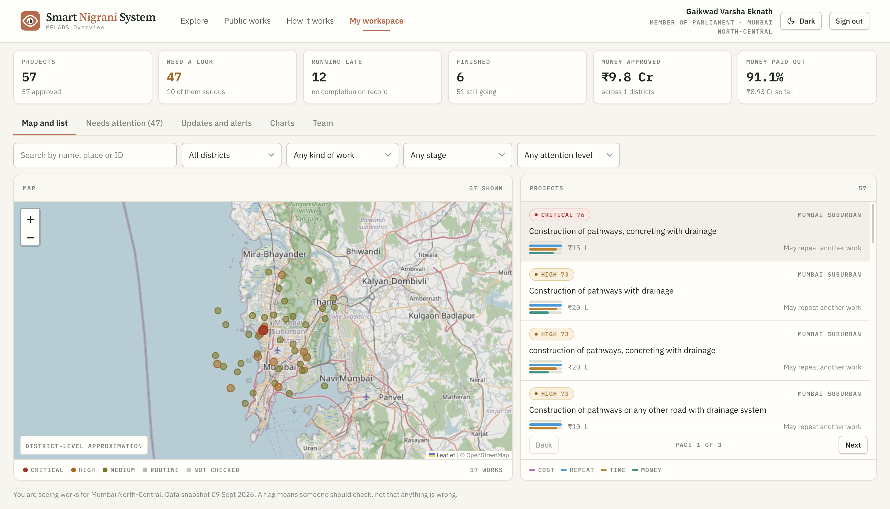
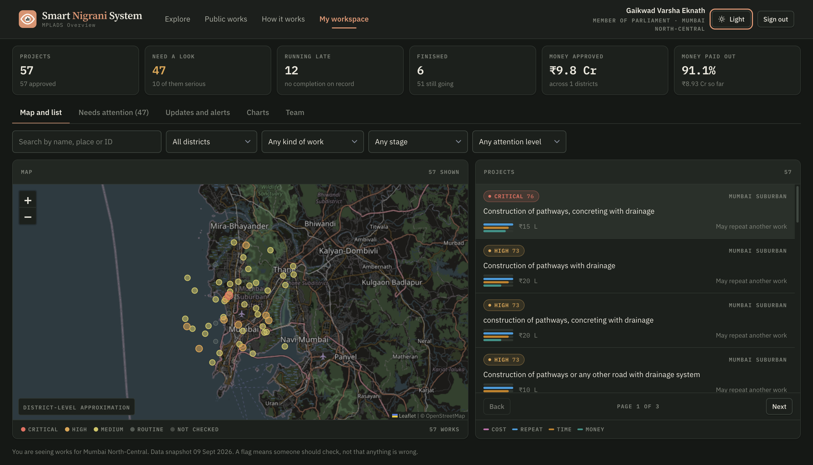

<div align="center">


# Smart Nigrani System

**Explainable review support for MPLADS works: find the works that need a closer look, show why, and follow them on the ground.**

[](https://smart-nigrani-system.vercel.app/)
[](https://www.youtube.com/watch?v=vg-pKbTyaAs)


[Live Demo](https://smart-nigrani-system.vercel.app/) · [Repository](https://github.com/rehanrahim7/smart-nigrani-system) · [Demo Video](#-demo-video) · [How it works](#-how-it-works) · [Run locally](#-run-it-locally)

</div>

---

## 📌 At a glance

| | |
|---|---|
| **Problem Statement ID** | SIH26102 |
| **Problem Statement** | Development of an AI-powered system to detect anomalies, fraud, and inefficiencies in MPLAD Scheme implementation |
| **Theme** | Smart Automation |
| **Category** | Software |
| **Team** | SNS (Team ID 159098) |
| **Data** | Published MPLADS reports for **Maharashtra**, snapshot **9 September 2026** |
| **Scale** | **4,798 works** (2,437 sanctioned + 2,361 recommendations without a work ID), **47 MPs**, **39 districts** |

> [!IMPORTANT]
> Smart Nigrani is a **review-support tool**. A flag is a reason for a person to look, never a finding of fraud. The data has no confirmed fraud cases, so no accuracy figure exists and none is claimed.

---

## 🧭 The problem

Under the **Members of Parliament Local Area Development Scheme (MPLADS)**, each MP recommends local works (roads, community halls, street lights, water, schools) that district authorities sanction and pay for. The records are public, but they are spread across **five separate reports**: works recommended, works sanctioned, works completed, expenditure, and allocated limits.

**Why it matters**

- Thousands of works per state make manual review slow; reviewers need a way to decide **where to look first**.
- Warning signs (a cost far above similar works, a near-duplicate description, long delays, money paid ahead of progress) only show up when the reports are **joined and compared**.
- Once a work is sanctioned, there is little structured way to record **what was actually built, bought and photographed** on site.

## 💡 Our solution

Smart Nigrani joins the five reports into **one record per work**, runs **explainable checks** and an **unsupervised anomaly model** on every sanctioned work, and ranks them into a **review queue**. Every flag comes with a plain-language reason. Around that queue it adds role-based dashboards so the people delivering a work (contractor, field officer, implementing agency) can log expenses and upload site photographs, and the MP can act on them.

---

## ✨ Key features

<table>
<tr>
<td width="50%" valign="top">

### 🎯 Review priority (0–100)
Four checks per sanctioned work: **cost vs. semantically similar works**, **possible repeat of another work**, **time taken**, **money paid vs. progress**. Weighted into one score and labelled **Critical / High / Medium / Routine**.

</td>
<td width="50%" valign="top">

### 🌲 Isolation Forest anomaly model
An unsupervised model trained on 2,437 sanctioned works. Shows how statistically unusual a work is as a **percentile**, kept separate from the rule-based score as a second opinion.

</td>
</tr>
<tr>
<td valign="top">

### 📋 Seven record checks
Rules run on every work, including imported datasets: peer cost outlier, similar description, slow sanction, long-running without completion, sanction above recommendation, payments above sanction, dates out of order.

</td>
<td valign="top">

### 🔍 Per-work investigation view
Tabs for **Why flagged**, **Peer comparison**, **Timeline**, **Similar works**, **Model opinion**, **Source records**, plus **Export case file** (Markdown).

</td>
</tr>
<tr>
<td valign="top">

### 🧾 Delivery & field evidence
Contractors log itemised expenses; the server flags over-budget claims, repeated invoices, unusual rates and materials billed at Planning stage. Field officers upload site photos with optional GPS; exact photo re-use is detected.

</td>
<td valign="top">

### 🗺️ Public transparency pages
Animated landing page, MP-to-work network, map of every work, searchable public register, and a "How it works" explainer. MPs appear only as aliases on public pages.

</td>
</tr>
<tr>
<td valign="top">

### 🔬 Research workspace
Analysts filter and sort all works by any of the three views, record private review decisions, and **import newer report exports** as separate datasets (never overwriting the original).

</td>
<td valign="top">

### 🤖 Optional Gemini photo notes
With consent, a field photo can be sent to **Google Gemini** for a description against the work's scope. Server-side key, daily per-account limit; the output is a note for a human reviewer.

</td>
</tr>
</table>

---

## ⚙️ How it works



Each sanctioned work gets **three separate views that are never added together**:

| View | What it measures | Implemented in |
|---|---|---|
| **Review priority** (0–100) | Four checks combined as `0.30 × cost + 0.25 × duplicate + 0.25 × delay + 0.20 × payment`, plus **5 points per active check** (max 3). Labels: **≥ 75 Critical**, **≥ 55 High**, **≥ 35 Medium**, else **Routine**. Works the checks never ran on are labelled **Not checked**, not Routine. | `backend/app/enrich.py`, using detector scores in `backend/data/source/` |
| **Record checks** (7 rules) | Transparent rules over the joined reports (table below) | `backend/app/pipeline.py` |
| **Model percentile** | How unusual a work looks compared with the 2,437 works the Isolation Forest was trained on | `backend/app/anomaly.py`, `backend/data/model.json` |

---

## 🧠 AI/ML and anomaly detection

### 1. The four checks (review priority)

| Check | Signal | Counts as "active" when |
|---|---|---|
| Cost looks unusual | Sanctioned amount vs. works with **semantically similar descriptions** | score ≥ 50 |
| May repeat another work | Text overlap with another work (same agency / constituency / year taken into account) | score ≥ 75 |
| Taking a long time | Delay since sanction | score ≥ 60 |
| Money ahead of progress | Payments vs. recorded progress | score ≥ 50 |

The per-work scores for these checks come from the team's **offline detector pipeline** (which uses sentence-transformer text similarity) and are shipped as CSVs in `backend/data/source/`. The backend reads those CSVs and combines them into the review priority. The offline pipeline itself is not part of this repository.

**Current snapshot:** 4 Critical · 74 High · 186 Medium · 2,166 Routine · 2,368 Not checked.

### 2. Isolation Forest (unsupervised anomaly model)

| Item | Detail |
|---|---|
| Algorithm | scikit-learn `IsolationForest`, 160 trees, seed 42 |
| Training set | 2,437 sanctioned works; **no fraud labels** (unsupervised) |
| Features | `log(1 + sanctioned amount)`, `paid / sanctioned`, `log(1 + payment count)`, `days recommendation → sanction`, `days since sanction` |
| Preprocessing | Median imputation → RobustScaler (stored in the model file) |
| Serving | The trained forest is exported to `data/model.json` and scored in **plain Python** (`app/anomaly.py`), so the API needs no scikit-learn at runtime |
| Output | Anomaly score and **percentile** vs. the training works, shown as "Model opinion" |
| Parity | `scripts/verify_data.py` checks that the served score matches scikit-learn's training output for **all 2,437 works** |

The model is deliberately **not part of the review priority**. It is a second opinion from a different method, and the model card (`backend/analysis/model-card.json`) states its scope: *"Exploratory ranking on this snapshot; not a prediction of fraud or future delay."*

### 3. Record checks (rules)

| Rule | Condition |
|---|---|
| Peer cost outlier | Amount > Q3 + 3×IQR **and** > 2.5× the median of ≥ 8 peers (same authority, category, year) |
| Similar description | ≥ 85% word overlap with another work in the same constituency and category |
| Slow sanction | More than 45 days from recommendation to sanction |
| Long-running | Over 365 days since sanction with no completion record |
| Sanction above recommendation | Sanctioned more than 10% above the recommended amount |
| Payments above sanction | Successful payments exceed the sanctioned amount |
| Date sequence | A milestone recorded before the one that should precede it |

### 4. Delivery checks (on submissions)

When a contractor logs an expense, `backend/app/delivery.py` adds review notes (it never blocks the claim): total above the approved amount, repeated invoice and material, materials billed while the work is at *Planning*, and a rate more than **1.3×** earlier claims for the same material and unit (needs at least 3 earlier claims). Photos are checked as real JPEGs and hashed (SHA-256) so the **exact same photo re-used** is detected.

---

## 👥 User roles and dashboards

| Role | Dashboard | What they can do |
|---|---|---|
| 🌐 **Public** (no sign-in) | Landing, Works register, Work page, How it works | Browse every work, the map and network; MPs shown only as aliases; delivery-team content is never public |
| 🏛️ **Member of Parliament** | Map and list · Needs attention · Updates and alerts · Charts · Team | See flags and model results for their works, follow the team's submissions, act on submissions (request clarification, request a site visit, mark evidence reviewed, escalate to authority), record decisions |
| 🏗️ **Implementing agency** | Works · Register a work · Submissions · Team and access | Register new works, assign a contractor and field officer, add team members, act on submissions |
| 👷 **Contractor** | Your works · Team | Log itemised expenses (quantity, unit, rate, invoice), add site photos. **Never sees scores or flags** |
| 📸 **Field officer** | Your works · Team | Upload site photos with stage, note and optional location; request a Gemini photo description |
| 🔬 **Research analyst** | Overview · Works · Network · My reviews · Data · Methods | Read every work, import new datasets, switch datasets, record private decisions, presentation mode |

Access is enforced on the server: only **MP and analyst** roles receive check and model results, and team roles see only their own MP's works (out-of-scope requests return 404).

### Workflow: from flag to field



---

## 🛠️ Technology stack

| Layer | Technology |
|---|---|
| Frontend | React 19, TypeScript, Vite 8, Leaflet (maps), react-markdown + remark-gfm, oxlint |
| Backend | Python 3.12, FastAPI, Uvicorn, Pydantic, python-dotenv, httpx |
| Storage | `data/projects.json` for works (loaded into memory); SQLite for accounts, work logs, evidence photos, reviews and imported datasets |
| ML | scikit-learn Isolation Forest (offline training, `analysis/`); pure-Python scoring at runtime |
| Auth | PBKDF2-HMAC-SHA256 password hashing and HMAC-signed tokens (Python standard library) |
| Optional AI | Google Gemini (`gemini-2.5-flash` by default) for photo descriptions |
| Optional mirror | `scripts/sync_supabase.py`: one-way copy to Supabase (the app itself always runs on local storage) |
| Hosting | Frontend on **Vercel**, API on **Render** (`backend/render.yaml`) |

## 🏗️ Architecture



---

## 📁 Project structure

```text
smart-nigrani-system/
├── backend/
│   ├── app/
│   │   ├── main.py          # FastAPI app, CORS, /api/health, /api/meta
│   │   ├── config.py        # settings from environment variables
│   │   ├── pipeline.py      # joins the 5 reports; 7 record checks; model features
│   │   ├── enrich.py        # map position, sector, 4 checks, review priority
│   │   ├── anomaly.py       # Isolation Forest scoring (pure Python)
│   │   ├── delivery.py      # registered works, expense checks, overdue works
│   │   ├── store.py         # in-memory works + SQLite storage
│   │   ├── deps.py          # current user and role scoping
│   │   ├── security.py      # password hashing, signed tokens
│   │   ├── models.py        # request validation
│   │   └── routers/         # auth, public, projects, works, delivery, research, stats
│   ├── analysis/            # train.py, model-card.json, training-scores.json
│   ├── data/
│   │   ├── raw/             # the 5 MPLADS reports + cleaned master and payments
│   │   ├── source/          # offline detector output (the 4 checks)
│   │   ├── model.json       # trained Isolation Forest
│   │   ├── district_coords.json
│   │   └── projects.json    # built by scripts/prepare_data.py, loaded at startup
│   ├── scripts/             # prepare_data, verify_data, test_workflows, smoke_test, seed_users, sync_supabase
│   ├── requirements.txt
│   ├── render.yaml
│   └── .env.example
├── frontend/
│   ├── src/
│   │   ├── pages/           # Landing, Works, WorkPage, HowItWorks, Login, Mp/Agency/Vendor dashboards, ResearchWorkspace
│   │   ├── components/      # map, network, charts, updates feed
│   │   │   └── work/        # per-work tabs: Checks, Peers, Timeline, Similar, ModelTab, Evidence, WorkLog, Reviews…
│   │   ├── api.ts           # API client (VITE_API_BASE)
│   │   └── router.ts        # hash-based routing
│   ├── public/              # icons, manifest, images
│   ├── package.json
│   ├── vite.config.ts
│   ├── vercel.json
│   └── .env.example
└── README.md
```

---

## 🚀 Run it locally

**Prerequisites:** Python 3.10+ and Node.js 20+.

### 1. Backend (API)

```bash
cd backend
python3 -m venv .venv
source .venv/bin/activate        # Windows: .venv\Scripts\activate
pip install -r requirements.txt
uvicorn app.main:app --reload --port 8000
```

Check <http://localhost:8000/api/health>. Interactive API docs: <http://localhost:8000/docs>.
On first start the server creates the SQLite database and the sample accounts.

### 2. Frontend (website)

```bash
cd frontend
npm install
npm run dev
```

Open <http://localhost:5173>. The frontend calls `http://127.0.0.1:8000` by default.

### 3. Sign in with a sample account

On the sign-in page, pick a role tab and click a sample account (one click, no password). To type one instead, every sample account uses the password set by `DEMO_PASSWORD` (default `nigrani`).

| Role | Example username |
|---|---|
| MP | `sanjay.jadhav` |
| Contractor | `contractor.sanjay.jadhav` |
| Field officer | `officer.sanjay.jadhav` |
| Implementing agency | `agency.sanjay.jadhav` |
| Research analyst | `analyst1` |

47 MP teams of four plus 2 analysts: **190 sample accounts**.

### Rebuild the data (optional)

```bash
cd backend
python scripts/prepare_data.py    # data/raw + data/source -> data/projects.json
```

---

## 🔐 Environment variables

All are optional; the app runs with none set. Copy the example files and **never commit a real `.env`**.

```bash
cp backend/.env.example backend/.env
cp frontend/.env.example frontend/.env    # only if the API is not at 127.0.0.1:8000
```

**Backend (`backend/.env`)**

| Variable | Purpose | Default |
|---|---|---|
| `SECRET_KEY` | Signs sign-in tokens. **Must be changed on any public server.** | development value |
| `TOKEN_TTL_SECONDS` | Token lifetime | `43200` (12 h) |
| `DEMO_ACCOUNTS` | `off` removes the one-click sample sign-in | `on` |
| `DEMO_PASSWORD` | Password of the sample accounts | `nigrani` |
| `CORS_ORIGINS` | Extra allowed frontend addresses (comma-separated) | localhost:5173 / 4173 |
| `CORS_ORIGIN_REGEX` | Allowed address pattern | `*.vercel.app`, `*.netlify.app`, `*.onrender.com`, `*.github.io` |
| `SNS_DB` | SQLite file path | `backend/data/sns.sqlite3` |
| `GEMINI_API_KEY` | Enables Gemini photo descriptions (server-side only) | not set |
| `GEMINI_MODEL` | Gemini model | `gemini-2.5-flash` |
| `GEMINI_DAILY_LIMIT` | Descriptions per account per day | `20` |
| `DATA_BACKEND`, `SUPABASE_URL`, `SUPABASE_KEY` | Only for the optional `sync_supabase.py` mirror | `local` |

**Frontend (`frontend/.env` or Vercel project settings)**

| Variable | Purpose | Default |
|---|---|---|
| `VITE_API_BASE` | Backend URL, read **at build time** (rebuild after changing) | `http://127.0.0.1:8000` |

---

## ✅ Checks

Run from `backend/` with the virtual environment active:

| Command | What it verifies |
|---|---|
| `python scripts/verify_data.py` | Report join reproduces the recorded totals; model score and percentile match training for all 2,437 works; priority counts; `projects.json` up to date (**30 checks**) |
| `python scripts/test_workflows.py` | Every workflow on a throwaway database: public anonymity, role scoping, expense checks, evidence, reviews, registration, imports (**75 checks**) |
| `python scripts/smoke_test.py` | The running API end to end (start the server first) |

Frontend: `npm run build` (type-check + production build) and `npm run lint`.

---

## ☁️ Deployment

| Part | Platform | Configuration |
|---|---|---|
| Frontend | Vercel | `frontend/vercel.json`: `npm run build`, output `dist/`, all routes to `index.html`. Set `VITE_API_BASE` to the Render URL. |
| Backend | Render | `backend/render.yaml`: `pip install -r requirements.txt`, then `uvicorn app.main:app --host 0.0.0.0 --port $PORT`, health check `/api/health`. Set `SECRET_KEY` and, optionally, `GEMINI_API_KEY`. |

`backend/data/projects.json` must be committed (or generated during the build with `python scripts/prepare_data.py`), because the API loads it at startup.

---

## 🖼️ Screens

| Screen | Link |
|---|---|
| Landing page with MP network and top flagged works | [Open](https://smart-nigrani-system.vercel.app/#/) |
| Public register of works with filters | [Open](https://smart-nigrani-system.vercel.app/#/works) |
| How it works (method, checks, model, limits) | [Open](https://smart-nigrani-system.vercel.app/#/how-it-works) |
| Sign in with a sample account | [Open](https://smart-nigrani-system.vercel.app/#/signin) |

## Screenshots

### Landing Page

| Light Mode | Dark Mode |
|---|---|
|  |  |

### Work Investigation View

| Light Mode | Dark Mode |
|---|---|
|  |  |

### MP Dashboard

| Light Mode | Dark Mode |
|---|---|
|  |  |

---

## 🎬 Demo video

▶️ **[Watch the demo on YouTube](https://www.youtube.com/watch?v=vg-pKbTyaAs)**

---

## ⚠️ Limitations

- **No fraud labels.** No confirmed cases exist in the data, so there is no accuracy figure. Flags are prompts for human review.
- **District-level map.** The reports have no coordinates; map positions are district centres and are labelled as approximate.
- **Totals only.** The reports have no quantities, specifications or physical progress; cost comparisons use total amounts.
- **The four checks need the offline pipeline.** Imported datasets get the record checks and the model, but show "Not checked" for the four checks.
- **Payments have no transaction IDs**, so a repeated payment cannot be told apart from a second instalment.
- **Updates use polling** (every 30 seconds). No email, SMS or push notifications.
- **Sample accounts only.** Roles are enforced by the server, but there is no government identity verification.
- **Storage is a single SQLite file.** On a host without a persistent disk, logs and photos added through the site may be lost on redeploy or restart.
- **Retraining:** `analysis/train.py` reads `data/analyzed.json`, which is not committed and not written by the current scripts.

## 🔭 Future scope

- Bring the offline detector pipeline (semantic cost and duplicate detection) into the repository so imported datasets can get all four checks.
- Collect reviewer decisions as labels, so the model can be evaluated and improved over time.
- Extend beyond Maharashtra to other states' MPLADS data.
- Integrate official identity sign-in for government roles.
- Real-time notifications (email/SMS/push) instead of polling.
- Managed database and object storage for photos.

---

## 👨‍💻 Team SNS

| | |
|---|---|
| **Team name** | SNS |
| **Team ID** | 159098 |
| **Problem Statement** | SIH26102 |

| Member | Role |
|---|---|
| Rehan Rahim | Team Leader |
| Sandesh Dnyanoba Shirse | Member |
| Rahul Dhananjay Tripathi | Member |
| Kadambari Shriniwas Mane | Member |
| Pruthvirajsingh Santoshsingh Jamadar | Member |
| Shravani Dipak Tupe | Member |

## 📄 License

No license has been chosen for this repository yet. Until one is added, all rights are reserved by the authors.

The landing-page photograph (`frontend/public/images/maharashtra-road-*.jpg`) is by **McKay Savage**, via Wikimedia Commons, licensed [CC BY 2.0](https://creativecommons.org/licenses/by/2.0/). See `frontend/public/images/CREDITS.txt`.

MPLADS data is from the published MPLADS reports for Maharashtra.

---

<div align="center">

**[Live Demo](https://smart-nigrani-system.vercel.app/)** · **[GitHub](https://github.com/rehanrahim7/smart-nigrani-system)** · **[Demo Video](https://www.youtube.com/watch?v=vg-pKbTyaAs)**

Built for **Smart India Hackathon 2026** by Team **SNS**

</div>
